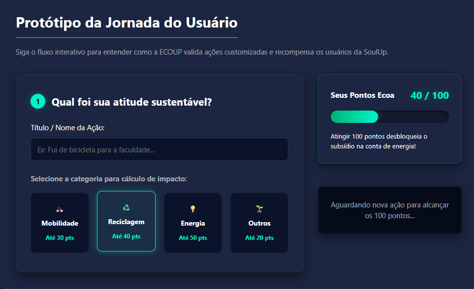

# ECOUP - Gamificação Sustentável para SoulUp

## 📝 Título e Descrição do Projeto
O **ECOUP** é uma aplicação Single Page Application (SPA) desenvolvida para a plataforma SoulUp, focada em resolver a queda de engajamento dos usuários através da **Gamificação Sustentável**. A solução simula a validação de atitudes ecológicas reais enviadas pelo usuário, convertendo-as em Pontos Ecoa (de 0 a 100). Estes pontos geram benefícios reais e escaláveis, apresentados no nosso **Catálogo de Recompensas**, como subsídios totais ou parciais na conta de energia elétrica, criando uma mecânica de retenção forte e duradoura.

---

## 🚀 Tecnologias Utilizadas
O projeto foi desenvolvido seguindo estritamente as tecnologias e bibliotecas:

* **React (`react`, `react-dom`)**: Biblioteca principal para construção de interfaces.
* **Vite (`vite`)**: Bundler e ambiente de desenvolvimento local de altíssima performance.
* **TypeScript (`typescript`)**: Utilizado para tipagem estática básica e segurança estrutural do código.
* **Tailwind CSS (`tailwindcss`, `@tailwindcss/vite`)**: Framework utilitário utilizado para 100% da estilização e responsividade (Mobile-First, Tablet, Desktop), substituindo arquivos CSS externos.
* **React Router DOM (`react-router-dom`)**: Gerenciamento de navegação em SPA via `createBrowserRouter` e `<Outlet/>`. Utilização de navegação estática e rotas dinâmicas com os hooks **`useNavigate`** e **`useParams`**.
* **React Hook Form (`react-hook-form`)**: Biblioteca para gerenciamento de estado e validação nativa de formulários (aplicada na página de Contato).

---

## 📁 Estrutura de Pastas do Projeto
A arquitetura foi organizada separando rotas e componentes reutilizáveis de forma escalável e modular, com cada página ou módulo possuindo seu próprio diretório:

```text
my-app/
├── public/
│   └── img/                      # Imagens estáticas, mockups e fotos da equipe
├── src/
│   ├── components/               # Componentes isolados e reutilizáveis (UI)
│   │   ├── Botao/
│   │   ├── Cabecalho/
│   │   ├── Cards/
│   │   └── Rodape/
│   ├── routes/                   # Componentes de páginas roteáveis (SPA)
│   │   ├── Contato/              # index.tsx
│   │   ├── Dashboard/            # index.tsx
│   │   ├── Faq/                  # index.tsx
│   │   ├── Home/                 # index.tsx
│   │   ├── Integrantes/          # index.tsx
│   │   ├── RecompensaDetalhes/   # index.tsx (Rota Dinâmica)
│   │   ├── Recompensas/          # index.tsx (Rota Estática)
│   │   ├── Simulador/            # index.tsx
│   │   └── Sobre/                # index.tsx
│   ├── App.tsx                   # Componente de Layout base
│   ├── main.tsx                  # Ponto de entrada e roteador central
│   └── index.css                 # Arquivo CSS global com Tailwind
├── package.json                  # Dependências e scripts do projeto
├── tsconfig.json                 # Configurações do compilador TypeScript
└── vite.config.ts                # Configurações do build e plugins
```


---

## ⚙️ Como Usar (Instalação e Execução)

Siga os passos abaixo para rodar a aplicação localmente:

1. **Clone o repositório:**
```bash
git clone [https://github.com/nicolaspk/ecoup-gamificacao-sprint3.git](https://github.com/nicolaspk/ecoup-gamificacao-sprint3.git)

```


2. **Acesse a pasta do projeto:**
```bash
cd my-app

```


3. **Instale as dependências:**
```bash
npm install

```


4. **Execute o servidor de desenvolvimento:**
```bash
npm run dev

```


5. **Acesso:** Abra o navegador na URL indicada no terminal (geralmente `http://localhost:5173/`).

* **Link do repositório no GitHub:** [Repositório ECOUP](https://github.com/nicolaspk/ecoup-gamificacao-sprint3)
* **Link do vídeo no YouTube:** [INSERIR LINK DO VÍDEO AQUI]

---

## 🖼️ Imagens do Projeto
Abaixo estão as capturas de tela reais do nosso sistema, demonstrando a interface gráfica e a aplicação da responsividade.

### Apresentação Visual (Logo ECOUP)


### Dashboard Executivo
Painel de análise de dados da SoulUp com métricas interativas.
<br>


### Telas do Protótipo (Simulador da IA)
Capturas do envio de evidências e cálculo do fluxo.
<br>

<br><br>


---

## 👥 Autores
Equipe responsável pelo desenvolvimento:

<table align="center">
  <tr>
    <td align="center">
      <br>
      <b>Maria Eduarda Escandor</b><br>
      RM: 568216 | 1TDSPO<br>
      <a href="https://www.linkedin.com/in/maria-eduarda-escandor-5b1587359/">LinkedIn</a> | <a href="https://github.com/mariabatistaescandor-gif">GitHub</a>
    </td>
    <td align="center">
      <br>
      <b>Erick Menezes</b><br>
      RM: 570325 | 1TDSPF<br>
      <a href="https://www.linkedin.com/in/erick-menezes-b53009232/">LinkedIn</a> | <a href="https://github.com/Erick488-maker">GitHub</a>
    </td>
    <td align="center">
      <br>
      <b>Matheus Yudi</b><br>
      RM: 571245 | 1TDSPF<br>
      <a href="https://www.linkedin.com/in/matheus-yudi7/">LinkedIn</a> | <a href="https://github.com/ogmatheus7">GitHub</a>
    </td>
  </tr>
  <tr>
    <td align="center" colspan="1"></td>
    <td align="center">
      <br>
      <b>Maria Eduarda Lopes</b><br>
      RM: 572425 | 1TDSPO<br>
      <a href="https://www.linkedin.com/in/maria-eduarda-lopes-de-lima-1291b6289/">LinkedIn</a> | <a href="https://github.com/mariaeduardaalima">GitHub</a>
    </td>
    <td align="center">
      <br>
      <b>Nicolas Sousa</b><br>
      RM: 574141 | 1TDSPH<br>
      <a href="https://www.linkedin.com/in/nicolas-sousaa/">LinkedIn</a> | <a href="https://github.com/nicolaspk">GitHub</a>
    </td>
  </tr>
</table>

---

## 📞 Contato
Dúvidas ou suporte sobre a implementação da Gamificação Sustentável:
* **E-mail Oficial da Equipe:** materiafiap@gmail.com